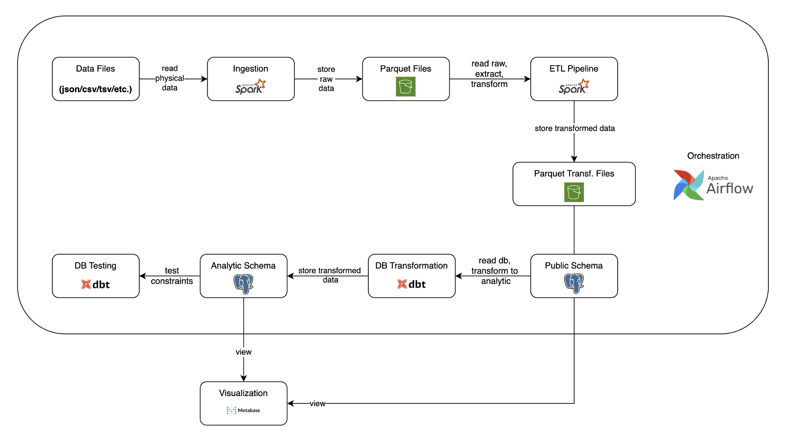

# ETL Project with PySpark & Airflow

## Pipeline Overview


## Build Instructions
1. Go to [MusicRecommendationDataset](http://ocelma.net/MusicRecommendationDataset/lastfm-1K.html) to download the dataset.

2. Copy the file `lastfm-dataset-1K.tar.gz` to the following directory: `root/module_pyspark_cluster/app/static_files/`

3. From the root folder, run:  
```bash
   make start
````
---

## Setup Database Visualization
This step is optional since any database management tool (e.g., DBeaver, TablePlus) can be
used to connect to the database. 
All you need are the credentials below to access the database
from the host.

- Database Type: PostgreSQL

- Display Name: Domain Model

- Host: listen_brainz_db_dm_container

- Port: 5443

- Database Name: domain_model_db

- Username: admin

- Password: password

---

## Run the Project

1. Access the **Apache Airflow UI**.
2. Login with the admin/password credential.
3. Trigger the DAG: `general etl job`.

---

## Demo Videos

* **Build Walkthrough**: [Watch here](https://youtu.be/1IGaGKrMQsc)
* **Data Ingestion & Analysis**: [Watch here](https://youtu.be/nuU23nYiz8c)

---
